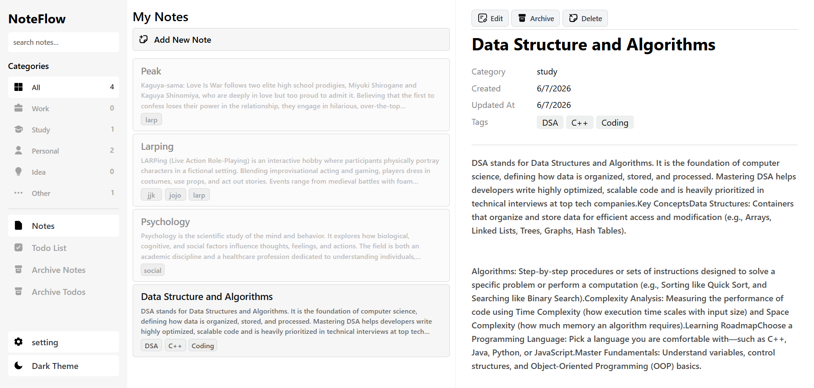
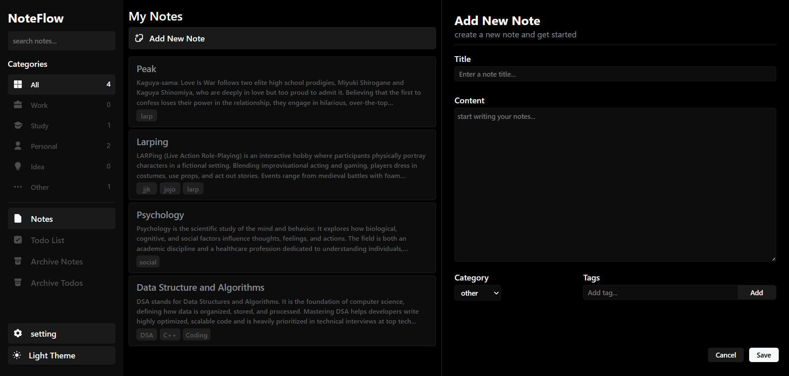
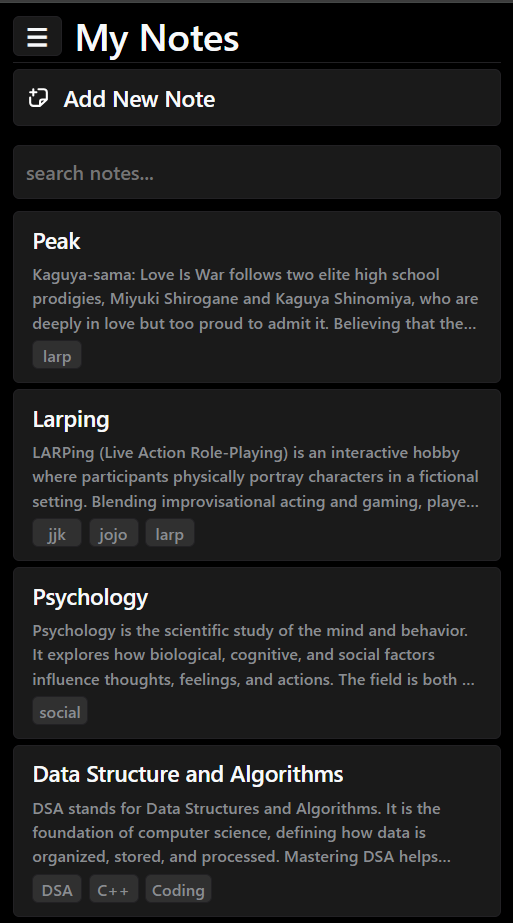
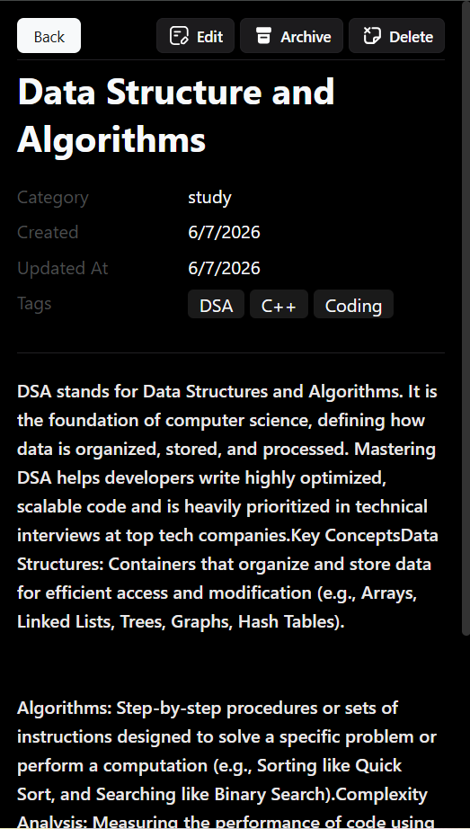

# NoteFlow
 
A modern React-based note-taking and task management app with a clean three-panel layout, dark mode, tagging, categories, and archive support.
Built to practice React state management, component architecture, responsive design, and localStorage persistence.

## Live Demo

https://noteflow-sigma-two.vercel.app/
 
---
 
## Features
 
- **Notes** — Create, edit, delete, and archive notes with a title, content, category, and tags
- **Todo Lists** — Create and manage todo lists with individual checkable tasks
- **Archive** — Archive notes and todo lists separately; unarchive them at any time
- **Categories** — Filter notes and todos by Work, Study, Personal, Idea, or Other
- **Tags** — Add custom tags to notes/todos and click any tag to filter by it
- **Search** — Real-time search across titles and content
- **Dark Mode** — Toggle between light and dark themes, persisted in localStorage
- **Undo Delete** — A 5-second toast notification lets you undo any deletion
- **Responsive** — Three-panel desktop layout collapses to a mobile-friendly single-panel view with a slide-in sidebar
---
 
## Screenshots
 
| Desktop — Light Mode | Desktop — Dark Mode |
|---|---|
|  |  |
 
| Mobile — Note List | Mobile — Preview |
|---|---|
|  |  |
 
---
 
## Tech Stack
 
- **React** (with hooks — `useState`, `useEffect`, `useRef`)
- **React Router v6** — client-side routing across pages
- **localStorage** — persistence for notes, todos, and theme preference
- **CSS custom properties** — full theming with light/dark variable sets
- **SVG icons** — imported as React components
---
 
## Project Structure
 
```
src/
├── App.js              # Root component — all state and handlers live here
├── index.js            # Entry point with BrowserRouter wrapper
├── index.css           # Global styles, CSS variables, responsive layout
│
├── Sidebar.js          # Navigation, category filters, search, theme toggle
├── Homepage.js         # Note list view (active notes)
├── Archivepage.js      # Note list view (archived notes)
├── Todo.js             # Todo list view (active todos)
├── Archivetodo.js      # Todo list view (archived todos)
│
├── Preview.js          # Note detail/preview panel
├── Previewtodo.js      # Todo detail/preview panel with checkboxes
│
├── Noteform.js         # Add / edit note form
├── Todoform.js         # Add / edit todo list form
│
└── EmptyState.js       # Reusable empty state component
```
 
---
 
## Routes
 
| Path | Page |
|---|---|
| `/` | Active Notes |
| `/archive` | Archived Notes |
| `/todo` | Active Todo Lists |
| `/archivetodo` | Archived Todo Lists |
 
---
 
## Getting Started
 
### Prerequisites
 
- Node.js (v16 or higher)
- npm or yarn

### Installation
 
```bash
# Clone the repository
git clone https://github.com/Ayush-fs-bit/react-notes-app.git
cd react-notes-app
 
# Install dependencies
npm install
 
# Start the development server
npm start
```
 
The app will open at `http://localhost:3000`.
 
### Build for Production
 
```bash
npm run build
```
 
---
 
## How It Works
 
### State Management
 
All state lives in `App.js` and is passed down as props. Key state includes:
 
- `notes` / `todoLists` — persisted to localStorage on every change
- `selectedNote` / `selectedTodoId` — tracks what's open in the preview panel
- `activeCategory`, `selectedTag`, `searchQuery` — filter state
- `isAdding`, `isEditing` — controls which form is shown in the preview panel
- `mobilePanel` — controls which panel is visible on mobile (`"home"` or `"preview"`)
- `deletedNote` / `deletedTodo` — stores the last deleted item for undo

### Undo Delete
 
When a note or todo is deleted, it's removed from state and stored temporarily in `deletedNote`/`deletedTodo`. A toast appears for 5 seconds with an Undo button. Clicking Undo re-inserts the item at its original index using `Array.splice`.
 
### Filtering Pipeline
 
Filters are applied in two stages:
 
1. `filterBySearchAndTags` — filters by search query and active tag
2. `filterByCategory` — filters the result by the selected category
This gives accurate per-category counts in the sidebar regardless of search input.
 
### Responsive Layout
 
- **Desktop (≥1086px):** Three-column grid — Sidebar | List | Preview
- **Tablet (769–1085px):** Two-column grid — Sidebar | List (preview slides in over list)
- **Mobile (≤768px):** Single column; sidebar slides in as an overlay; `mobilePanel` state toggles between the list and preview panels
---
 
## localStorage Keys
 
| Key | Value |
|---|---|
| `notes` | JSON array of all note objects |
| `todoLists` | JSON array of all todo list objects |
| `theme` | `"light"` or `"dark"` |
 
---
 
## Data Shapes
 
### Note object
```js
{
  id: number,          // Date.now()
  title: string,
  content: string,
  category: string,    // "work" | "study" | "personal" | "idea" | "other"
  isArchived: boolean,
  tags: [{ id: number, title: string }],
  createdAt: number,   // timestamp
  updatedAt: number | null
}
```
 
### Todo List object
```js
{
  id: number,
  title: string,
  todos: [{ id: number, text: string, completed: boolean }],
  category: string,
  isArchived: boolean,
  tags: [{ id: number, title: string }],
  createdAt: number,
  updatedAt: number | null
}
```

## Future Improvements

- Keyboard shortcuts
- Drag and drop task reordering
- Cloud synchronization
- User authentication
- Rich text editor support